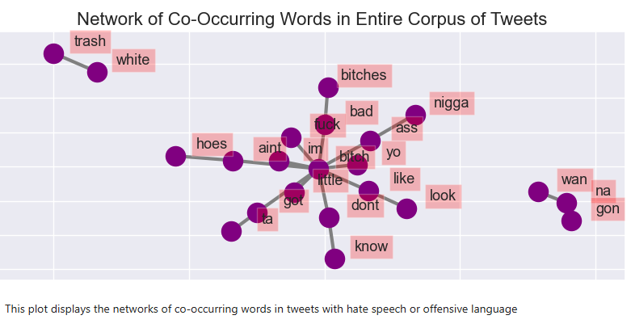

# 🐦 Twitter Hate Speech Detection  
A comprehensive Natural Language Processing (NLP) project focused on detecting hate speech on Twitter using linguistic preprocessing, exploratory text analysis, bigram networks, and machine learning models.
---

##  Project Overview
This project aims to identify hate speech within tweets using deep linguistic analysis and classical machine learning models. The notebook performs extensive preprocessing, frequency analysis, sentiment scoring, bigram association scoring, word cloud visualization, network graph analysis, and classification using models such as Logistic Regression and SVM.

The dataset contains raw tweets and associated labels (`hate` vs `not hate`). Using advanced NLP techniques, text is cleaned, censored, normalized, tokenized, vectorized, analyzed, and finally used to train classification models.
The workflow includes:

- Text cleaning & profanity censoring  
- Tokenization, stopword removal, stemming, and lemmatization  
- Word frequency analysis  
- Unique word comparison through Venn diagrams  
- Bigram frequency extraction and PMI scoring  
- Word clouds  
- Network graph analysis for bigrams  
- Sentiment scoring  
- Training ML models including Logistic Regression, SVM, Naive Bayes  

This end to end workflow provides a scalable and interpretable system for detecting harmful content on social platforms.

---

## Libraries Used

###  Core Python Packages
- **NumPy** – Efficient numerical operations and array processing.  
- **Pandas** – Data manipulation, cleaning, transforming tweet dataset.  
- **Matplotlib & Seaborn** – Visualizations, histograms, bar graphs, word frequency plots.  
- **matplotlib.cm** – Custom color maps for visualization.

###  NLP Libraries
- **NLTK (Natural Language Toolkit)** – Tokenization, stopword removal, stemming, lemmatization, bigram detection.
- **WordNetLemmatizer** – Converts words into root lemmas using the WordNet lexical database.
- **PorterStemmer** – Reduces words into stems (useful for comparison with lemmas).
- **FreqDist** – Extracts word frequency distributions.
- **Stopwords Corpus** – Removes commonly occurring English stopwords.
- **BigramCollocationFinder & BigramAssocMeasures** – Detects common word pairings and calculates association strength.

###  Text Vectorization
- **CountVectorizer** – Bag-of-Words (BOW) representation.  
- **TFIDFVectorizer** – Converts text into TF IDF matrix.  
- **TfidfTransformer** – Converts count matrix to TF IDF weights.

###  Machine Learning Models
- **Multinomial Naive Bayes** – Best for BOW and frequency-based features.  
- **Logistic Regression** – Strong linear classifier, performs well with TF IDF features.  
- **Support Vector Machine (SVM)** – Excellent for high-dimensional sparse text data.

###  Additional Libraries
- **TextBlob** – Sentiment analysis for extracted tweets.  
- **matplotlib_venn** – For visualizing unique vs overlapping vocabulary.  
- **WordCloud** – Generates visual clouds based on word frequencies.  
- **NetworkX** – Builds bigram co occurrence network graphs.  
- **Pickle** – Saves preprocessed text features for downstream modeling.

---

##  Data Cleaning & Preprocessing

### 1️⃣ Censoring Explicit Words  
A replacement dictionary was applied to censor profanity (e.g., `bitch → b**ch`, `fuck → f**k`).  
This helps maintain readability while preserving semantic meaning.

### 2️⃣ Exploratory Word Analysis
- Separated tweets into **hate** and **not hate** corpora.
- Calculated frequency counts using `FreqDist`.
- Identified:
  - **Top 20 most common hate words**
  - **Top 20 most common non hate words**
  - **Normalized frequencies**
  - **Words unique to hate speech** using set difference  
    `set(hate_words) - set(non_hate_words)`

### 🟦 Venn Diagram of Vocabulary  
Compares unique and overlapping words in hate vs non hate tweets.
 

### 4️⃣ Word Clouds  
Word clouds were generated for:
- Hate speech words  
- Non-hate words  

This helps visualize density and prominence of certain words.

---

##  Text Preprocessing Pipeline

###  Tokenization  
`nltk.word_tokenize()` splits each tweet into individual tokens.

###  Removing Stop Words  
Using NLTK’s English stop words corpus.  
This enhances model performance by removing words that add little semantic value.

###  Lemmatization  
Using **WordNetLemmatizer** to reduce each token to a linguistically meaningful base form.

###  Stemming (for comparison)  
PorterStemmer applied optionally to observe difference between stemmed and lemmatized tokens.

###  Pickling Processed Data 

Final processed features (`X_lem`) and labels (`y_lem`) are saved via pickle for machine learning.
---

##  Bigram Analysis
### Discovering Bigram Frequencies  
Bigrams capture meaningful word pairs such as:
('bitch', 'ass')
('look', 'like')
('white', 'trash')
('bad', 'bitch')
('fuck', 'bitch')

---
These bigrams reveal linguistic patterns and context of hate speech.

### PMI (Pointwise Mutual Information) Score  
PMI measures how strongly associated a pair of words are:

- **High PMI** → Words occur together more than expected by chance  
- **Indicates idiomatic, sarcastic, or contextually significant phrases**

This helps detect abusive multi word expressions not just single words.

## 🕸 Bigram Network Plot

Generated using **NetworkX**, this graph shows how common hate-related words cluster together.
  

This visualization helps identify:
- Aggressive word clusters  
- Frequently co occurring insults  
- Language patterns unique to hate speech  

---

##  Machine Learning Models

### **1. Multinomial Naive Bayes**
- Works best for **count based features** (Bag of Words).  
- Fast, efficient for large sparse text datasets.  
- Performs well when word frequency directly correlates with class.

### **2. Logistic Regression**
- Strong performance on **TF IDF features**.  
- Good baseline for linearly separable classes.  
- Preferred when feature space is large and sparse.

### **3. Support Vector Machine (SVM)**
- Excellent classifier for high-dimensional NLP data.  
- Uses hyperplanes to separate classes.  
- Works best with TF IDF inputs.  
- Often outperforms Naive Bayes in text classification tasks.
---
## Model Selection
| Model | Reason for Use | Best Scenario |
|-------|----------------|---------------|
| **Naive Bayes** | Extremely fast, good with BOW | Short text, frequency matters |
| **Logistic Regression** | Stable linear classifier | Balanced classes with TF IDF |
| **SVM** | Very accurate with sparse high dimensional data | Complex tweets with subtle hate cues |

In this project:
- **TF IDF + SVM** provided the most reliable results due to its margin based separation capability.
- Naive Bayes helped as a strong baseline.
- Logistic Regression offered highly interpretable coefficients.
---

##  Additional Corpus EDA

###  Bigrams Using NLTK  
Using `BigramCollocationFinder` and frequency filters to extract significant word pairs.

###  Mutual Information Score  
Higher score = words are highly dependent on each other → useful for hate speech patterns.

###  Bigram Network Plot  
Visual representation of co-occurring word clusters indicating:
- Toxic phrase groupings  
- Repeated abusive patterns  
- Contextual patterns in hate speech  

---
This project demonstrates end to end NLP workflow:
- Text cleaning  
- Preprocessing  
- Advanced frequency & bigram analysis  
- Visualization  
- Machine learning classification  

  It provides clear insight into hate speech patterns and offers a scalable, reproducible structure for real-world moderation systems.
---

##  Like This Project?  
If this repository helped you, **please drop a ⭐ on GitHub**

